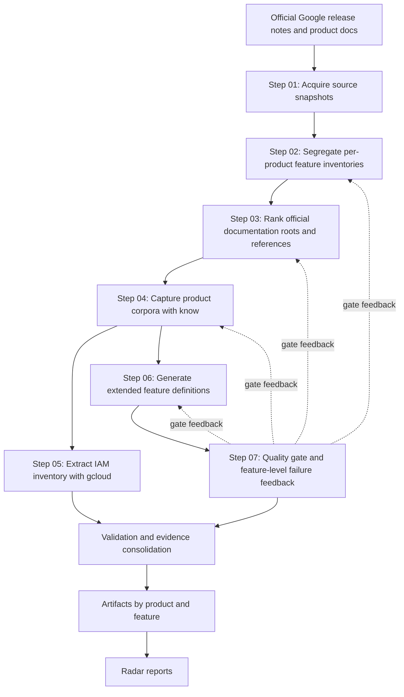

# gcp-radar Documentation

## What This Project Is

`gcp-radar` builds a traceable map of Google Cloud products and features from
official Google documentation only.

The repository is not a notes collection. It is a staged evidence pipeline
that:

- discovers products and feature signals
- finds the right official documentation roots and references
- captures product-specific documentation corpora
- extracts structured feature definitions and evidence
- promotes validated outputs into durable artifacts and final reports

The target result is a catalog where every important claim can be traced back
to real Google documentation, and where duplicated or weak evidence can be
reduced over time.

## Why It Exists

Google Cloud product information is spread across release notes, product docs,
API docs, IAM references, client-library docs, and host families such as
`docs.cloud.google.com` and `developers.google.com`.

Without a staged process, that information becomes:

- hard to audit
- hard to normalize
- easy to duplicate
- easy to contaminate across neighboring products

`gcp-radar` exists to turn that fragmented documentation surface into a
repeatable, machine-readable, evidence-backed research system.

## Core Principles

- Only official Google sources are authoritative.
- Every stage should leave machine-readable outputs behind.
- Broad crawlable documentation roots are usually more valuable than deep leaf
  pages.
- Coverage feedback from later stages must improve earlier stages.
- Documentation in this repository must remain explicit about evidence,
  assumptions, and limitations.

## Documentation Map

Use the documents in this order:

1. [Project Workflow Spec](C:/Users/villa/dev/gcp-radar/.specs/specs.md)
2. [Pipeline Detail](C:/Users/villa/dev/gcp-radar/docs/pipeline.md)
3. [Repository Map](C:/Users/villa/dev/gcp-radar/docs/repository-map.md)
4. [Strategy So Far](C:/Users/villa/dev/gcp-radar/docs/strategy-so-far.md)

## End-to-End Flow

## Current Operational Shape

The pipeline is already implemented through the middle stages. The practical
challenge is no longer “whether a stage exists”, but whether the selected
documentation for each product is broad, clean, and strong enough to support
high feature coverage in Step 06.

The most important current operating loop is:

1. improve Step 03 URL discovery and classification
2. rerun Step 04 corpus capture for targeted products
3. rerun Step 06 feature-definition extraction
4. run Step 07 quality gate
5. push that feedback back into Step 02, Step 03, Step 04, and Step 06

That loop is what steadily reduces unsupported or duplicate feature
definitions.

## Documentation Set In `docs/`

- [Pipeline Detail](C:/Users/villa/dev/gcp-radar/docs/pipeline.md)
  Explains each workflow step, inputs, outputs, and feedback loops.
- [Repository Map](C:/Users/villa/dev/gcp-radar/docs/repository-map.md)
  Explains what belongs in each top-level area and how to navigate the repo.
- [Strategy So Far](C:/Users/villa/dev/gcp-radar/docs/strategy-so-far.md)
  Captures the current implementation state and lessons learned from actual
  runs.

## When To Read What

- If you need project intent, read this file.
- If you need stage-by-stage execution logic, read
  [Pipeline Detail](C:/Users/villa/dev/gcp-radar/docs/pipeline.md).
- If you need to understand where files belong, read
  [Repository Map](C:/Users/villa/dev/gcp-radar/docs/repository-map.md).
- If you need the latest implementation lessons, read
  [Strategy So Far](C:/Users/villa/dev/gcp-radar/docs/strategy-so-far.md).
