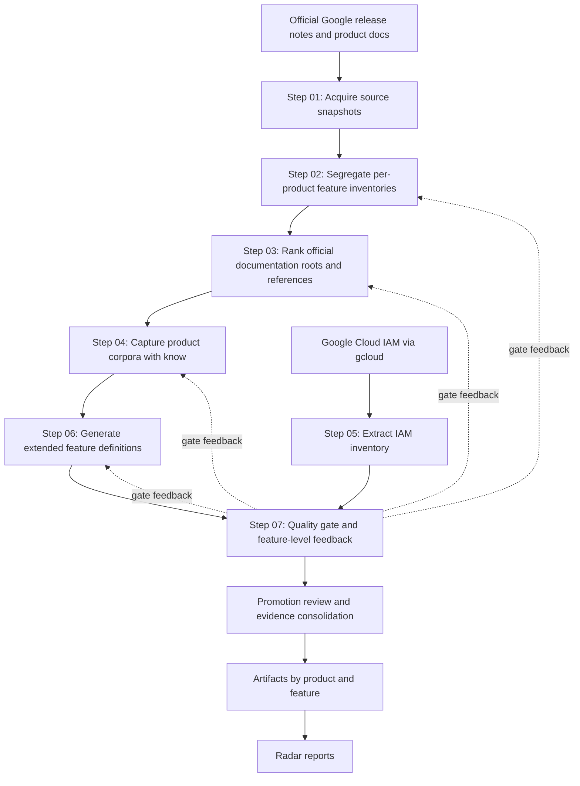

# gcp-radar Documentation

## Start here

- [Usage and setup](getting-started.md)
- [Repository layout, maintenance, and validation](repository-guide.md)
- [Harbor evaluation datasets and aggregate reports](../evaluations/README.md)
- [Agent instructions](../AGENTS.md)
- [Pipeline manual](pipeline.md)
- [Repository map](repository-map.md)
- [Strategy and limitations](strategy-so-far.md)


## What This Project Is

`gcp-radar` builds a traceable map of Google Cloud products and features from
official Google documentation only.

The repository is not a notes collection. It is a staged evidence pipeline
that:

- discovers products and feature signals
- finds the right official documentation roots and references
- captures product-specific documentation corpora
- extracts structured feature definitions and evidence
- promotes validated outputs into durable artifacts and final reports

The target result is a catalog where every important claim can be traced back
to real Google documentation, and where duplicated or weak evidence can be
reduced over time.

## Why It Exists

Google Cloud product information is spread across release notes, product docs,
API docs, IAM references, client-library docs, and host families such as
`docs.cloud.google.com` and `developers.google.com`.

Without a staged process, that information becomes:

- hard to audit
- hard to normalize
- easy to duplicate
- easy to contaminate across neighboring products

`gcp-radar` exists to turn that fragmented documentation surface into a
repeatable, machine-readable, evidence-backed research system.

## Core Principles

- Only official Google sources are authoritative.
- Every stage should leave machine-readable outputs behind.
- Broad crawlable documentation roots are usually more valuable than deep leaf
  pages.
- Coverage feedback from later stages must improve earlier stages.
- Documentation in this repository must remain explicit about evidence,
  assumptions, and limitations.

## Documentation Map

Use the documents in this order:

1. [Project Workflow Spec](C:/Users/villa/dev/gcp-radar/.specs/specs.md)
2. [Architecture](C:/Users/villa/dev/gcp-radar/docs/architecture.md)
3. [Pipeline Detail](C:/Users/villa/dev/gcp-radar/docs/pipeline.md)
4. [Repository Map](C:/Users/villa/dev/gcp-radar/docs/repository-map.md)
5. [Strategy So Far](C:/Users/villa/dev/gcp-radar/docs/strategy-so-far.md)

## End-to-End Flow



## Current Operational Shape

The pipeline is implemented through Step 07. The practical challenge is no
longer whether the middle stages exist; it is deciding which generated feature
outputs are strong enough to promote into source-of-truth artifacts.

The current working distinction is important:

- per-product outputs under `data/step-XX/current/` are the on-disk workspace
  inventory
- `current/index.json` is the latest-run index and can represent only a
  targeted rerun

The most important current operating loop is:

1. improve Step 03 URL discovery and classification
2. rerun Step 04 corpus capture for targeted products
3. rerun Step 06 feature-definition extraction
4. run Step 07 quality gate
5. triage Step 07 failures and warnings before promotion
6. push feedback back into Step 02, Step 03, Step 04, and Step 06

That loop is what steadily reduces unsupported or duplicate feature
definitions.

The next strategic boundary is promotion: defining how Step 07-passing feature
outputs become validated `artifacts/` entries and, later, `radar/` reports.

That boundary now has executable stages:

- Step 08 builds product and feature cards under `data/step-08/current/`.
- Step 09 promotes reviewed cards into `artifacts/`.
- Step 10 generates final `radar/` reports from promoted artifacts only.

## Documentation Set In `docs/`

- [Architecture](C:/Users/villa/dev/gcp-radar/docs/architecture.md)
  Defines the repository structure, workflow order, evidence flow, and
  promotion boundary with Mermaid diagrams.
- [Pipeline Detail](C:/Users/villa/dev/gcp-radar/docs/pipeline.md)
  Explains each workflow step, inputs, outputs, and feedback loops.
- [Repository Map](C:/Users/villa/dev/gcp-radar/docs/repository-map.md)
  Explains what belongs in each top-level area and how to navigate the repo.
- [Strategy So Far](C:/Users/villa/dev/gcp-radar/docs/strategy-so-far.md)
  Captures the current implementation state and lessons learned from actual
  runs.

## Final Output Flow

Use the final stages after Step 07 has produced gate outputs:

```bash
zx scripts/step-08/build-product-feature-cards.mjs
zx scripts/step-09/promote-validated-artifacts.mjs
zx scripts/step-10/generate-radar-reports.mjs
```

Step 09 promotes every product card under `data/step-08/current/products/` by
default. Use `GCP_RADAR_STEP09_PRODUCTS` only for targeted reruns.

Each promoted product has one unique service card at
`artifacts/<product-slug>/card.json`, plus feature artifacts under
`artifacts/<product-slug>/<feature-slug>/`.

The final output is expected to expose IAM at feature level. For every promoted
feature, the artifact and radar report should show:

- the IAM mapping status: `explicit`, `derived_from_permission_prefix`, or
  `unknown`
- explicit roles and permissions when official feature evidence names them
- derived roles and permissions only when they are clearly labeled as related
  IAM signals
- official Google evidence links supporting the feature description

Do not treat derived IAM data as a required role or permission. If no defensible
mapping exists, the feature must say that IAM is unknown rather than omitting
the field.

## When To Read What

- If you need project intent, read this file.
- If you need the overall structure and order, read
  [Architecture](C:/Users/villa/dev/gcp-radar/docs/architecture.md).
- If you need stage-by-stage execution logic, read
  [Pipeline Detail](C:/Users/villa/dev/gcp-radar/docs/pipeline.md).
- If you need to understand where files belong, read
  [Repository Map](C:/Users/villa/dev/gcp-radar/docs/repository-map.md).
- If you need the latest implementation lessons, read
  [Strategy So Far](C:/Users/villa/dev/gcp-radar/docs/strategy-so-far.md).
