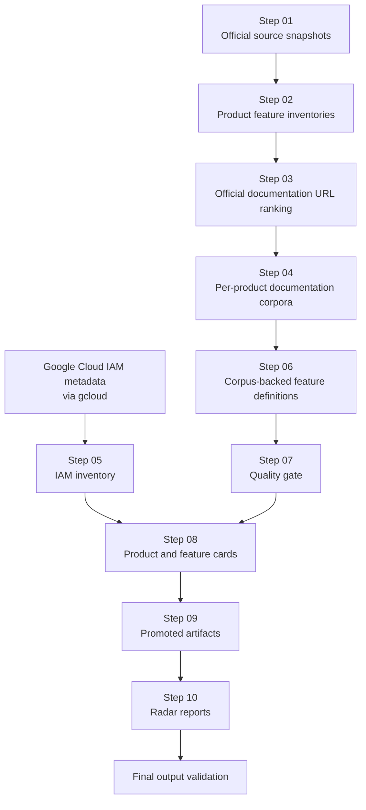
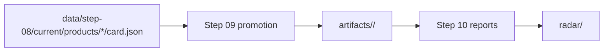

# Architecture

## Purpose

This document explains the durable shape of `gcp-radar`: the repository
boundaries, evidence flow, staged workflow, and final-output contract.

The architecture is designed around one rule: final reports must be generated
from promoted source-of-truth artifacts, and those artifacts must trace back to
official Google evidence.

## Evidence Boundary

Only official Google sources are authoritative for product and feature
intelligence. The current official host allowlist used by later-stage
validation is:

- `cloud.google.com`
- `docs.cloud.google.com`
- `developers.google.com`
- `firebase.google.com`
- `workspace.google.com`
- `googleapis.dev`

Non-official material can be used only for orientation outside the canonical
evidence path. It must not become authoritative evidence in generated cards,
promoted artifacts, or final radar reports.

## System Shape



## Repository Boundaries

The repository uses stage-oriented storage:

- `.specs/` stores workflow contracts, ADRs, and tracked issues.
- `docs/` stores canonical human-facing documentation.
- `scripts/` stores executable stage automation.
- `data/step-xx/` stores machine-readable stage outputs and state.
- `artifacts/` stores promoted source-of-truth product and feature artifacts.
- `radar/` stores final reports generated from promoted artifacts.
- `knowledge/` stores reusable research findings and extraction lessons.
- `skills/` and `evaluations/` store repository-specific agent and benchmark
  work.

`data/` can contain intermediate generated work. `artifacts/` and `radar/` are
the final-output boundary and are held to stricter validation.

## Stage Responsibilities

Steps 01 through 04 acquire and organize official documentation signals.

Step 05 materializes IAM role and permission metadata from Google Cloud tooling
so IAM mapping does not depend only on prose documentation.

Step 06 connects the product feature spine from Step 02 to the documentation
corpus from Step 04.

Step 07 is a quality gate over Step 06 outputs. A passing Step 07 result is
required for promotion, but passing alone does not make a feature final.

Step 08 constructs product and feature cards from Step 06 definitions, Step 07
gate results, Step 05 IAM inventory, and Step 04 corpus provenance. It is the
reviewable card layer before promotion.

Step 09 promotes eligible Step 08 cards into `artifacts/`. It writes a product
service card, product index, promotion manifest, and one card plus README per
promoted feature.

Step 10 generates `radar/` reports from `artifacts/` only. It must fail before
rewriting reports if promoted artifacts are incomplete, stale, or contain
non-official evidence.

## Promotion Boundary

The promotion boundary is the transition from generated data to validated
source-of-truth artifacts.



Promoted feature artifacts must retain:

- product and feature identity
- Step 08 provenance
- lifecycle and coverage data
- official Google evidence links
- IAM mapping status and details
- security capabilities and evidence links when present
- Step 07 validation summary

Generated radar reports must not read directly from Step 06, Step 07, or Step
08 as their source of truth. Step 08 remains provenance and validation context;
`artifacts/` is the reporting input.

## IAM Model

Feature IAM mapping uses three statuses:

- `explicit`: official feature evidence names a role or permission that exists
  in the Step 05 IAM inventory.
- `derived_from_permission_prefix`: a permission-prefix relationship is useful
  for review, but is not confirmed as a feature requirement.
- `unknown`: no defensible IAM mapping was found.

Reports and artifacts must keep explicit IAM evidence separate from derived
IAM signals. Derived mappings must not be described as required access.

## Index Semantics

For stages that write `data/step-xx/current/index.json`, the index describes
the latest invocation of that stage. A targeted rerun can therefore produce an
index whose run scope is smaller than the full on-disk workspace inventory.

Progress summaries must distinguish latest-run index counts from scans of
on-disk product outputs.

## Validation Contract

The final validation script is:

```bash
node scripts/validate-final-outputs.mjs
```

It checks that:

- Step 08 card JSON and Markdown stay aligned.
- Step 09 indexes, manifests, service cards, feature cards, and feature
  READMEs stay aligned.
- Step 10 indexes and radar Markdown stay aligned with promoted artifacts.
- external evidence links in final outputs use official Google HTTP(S) URLs.
- radar reports do not reference intermediate `data/step-*` paths.
- final-output directories under the validated boundary remain lowercase.

This validation is the acceptance gate for the current final radar output.
