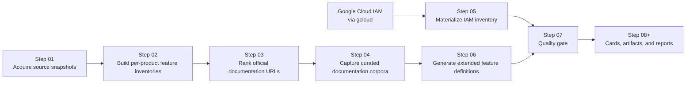
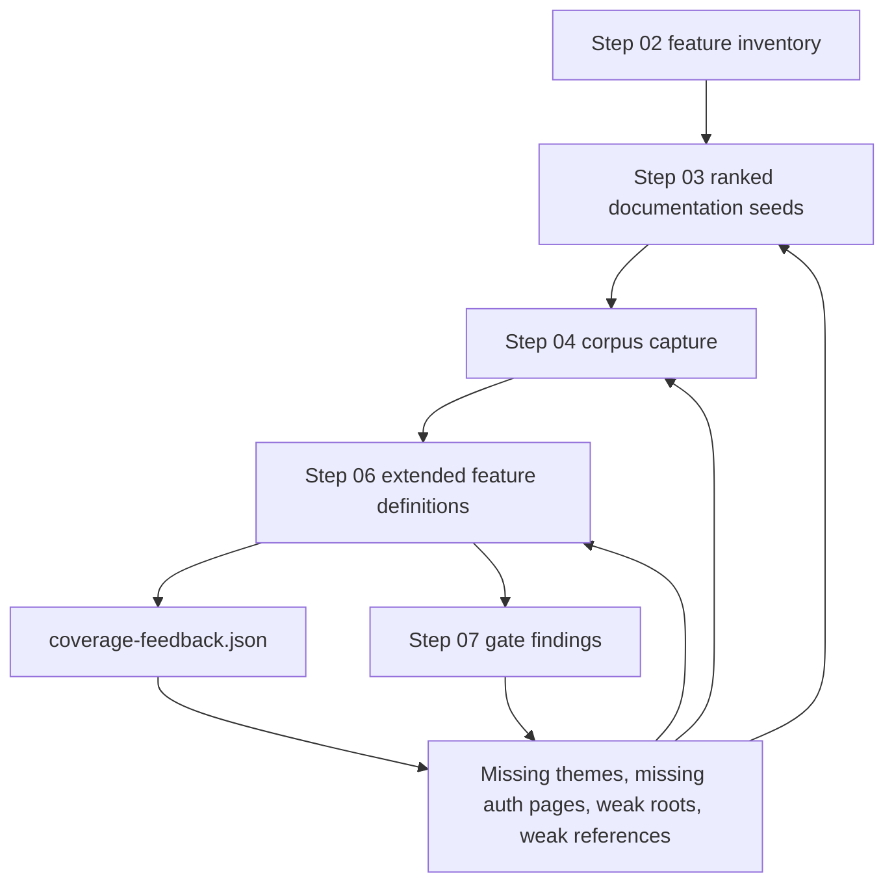
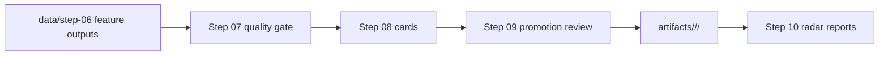

# Pipeline Detail

## Purpose

This document explains the execution model of `gcp-radar` in operational
terms: what each step consumes, what it produces, and how later stages feed
back into earlier ones.

## Pipeline Overview

## Index Semantics

`current/index.json` files are latest-run indexes. They describe the most recent
stage invocation, which can be a targeted product subset.

The on-disk workspace inventory is the set of product outputs under each
stage's documented `current/` layout. Progress summaries must label which view
they are using.

## Step 01

### Goal

Capture raw official source material into a stable local snapshot that can be
replayed and audited.

### Typical Inputs

- official Google release notes
- official product feeds or source pages

### Typical Outputs

- raw machine-readable snapshots under `data/step-01/`
- normalized source inventories for later steps

### Quality Bar

- deterministic enough to rerun
- explicit source provenance
- no silent dependency on manual browsing state

## Step 02

### Goal

Convert raw source signals into per-product feature inventories.

### Typical Inputs

- Step 01 snapshots

### Typical Outputs

- one markdown file per product under `data/step-02/current/`
- per-product feature counts, summaries, and date signals

### Why It Matters

Step 02 is the first place where product identity becomes concrete. Later
stages depend on it for query generation, coverage hints, and product-family
specific filtering.

## Step 03

### Goal

Find the best official documentation roots and references for each product.

### What It Actually Does

Step 03 is not a full crawler. It is a ranking stage.

It tries to answer:

- What page should represent the product root?
- What page should represent the main product reference?
- What API, IAM, Python, and Java pages are worth keeping?
- Which URLs are official but actually belong to a neighboring product?

### Inputs

- Step 02 feature inventories
- official Google web search results

### Outputs

- `ranking.json`
- `ranking.md`
- global Step 03 index

### Key Heuristics

- prefer crawlable parent pages over deep leaves
- prefer official roots on `docs.cloud.google.com` and `developers.google.com`
- penalize cross-product contamination
- use Step 02 vocabulary to reward feature-aligned pages

### Known Risk

A page can be official and still be a bad seed for corpus building if it is too
narrow, too deep, or not representative of the product.

## Step 04

### Goal

Build a practical documentation corpus for each product from the Step 03
ranking.

### What It Actually Does

Step 04 selects a small number of seeds by family and captures pages through
`know`.

The main concern is not maximum crawl volume. It is useful coverage with low
contamination.

### Inputs

- Step 03 rankings
- Step 02 feature inventory for budget shaping

### Outputs

- `selection.json`
- `state.json`
- per-product `corpus/`
- global Step 04 index

### Operational Signals

- `source_failures`
- `selected_sources_signature`
- `corpus_health`

These fields matter because they make failures reproducible and show whether a
reprocess changed the selected documentation surface.

## Step 05

### Goal

Collect IAM role and permission information directly from Google Cloud tooling.

### Inputs

- authenticated Google Cloud CLI access
- `gcloud iam roles list`
- `gcloud iam roles describe`

### Outputs

- machine-readable IAM inventories under `data/step-05/`

### Why It Exists Separately

Some IAM information is better captured from live tooling than from product
documentation alone.

## Step 06

### Goal

Generate extended feature definitions backed by the documentation corpus.

### Inputs

- Step 02 feature inventories
- Step 04 corpora

### Outputs

- `extended-features.json`
- `coverage-feedback.json`
- per-product state in `data/step-06/`

### What Makes Step 06 Valuable

Step 06 is both an extraction stage and a measurement stage.

It tells us:

- which features have support
- which features remain uncovered
- which tokens or concepts are missing from the current corpus

That feedback is what drives the improvement loop for Steps 03 and 04.

## Step 07

### Goal

Evaluate Step 06 feature definitions before any artifact promotion.

### Inputs

- Step 06 `extended-features.json` files
- Step 04 corpus pages for selected evidence checks

### Outputs

- `gate.json`
- `gate.md`
- global Step 07 latest-run index
- global triage artifacts:
  - `data/step-07/current/triage.json`
  - `data/step-07/current/triage.md`

### What Makes Step 07 Valuable

Step 07 separates "generated" from "acceptable for promotion".

It records:

- product-level pass or fail status
- feature-level failures and warnings
- exact rule identifiers
- suggested upstream stages for repair

A passing gate is still not final source-of-truth acceptance. Warnings must be
reviewed before promotion into `artifacts/`.

### Triage Workflow

Run `scripts/step-07/summarize-quality-gate-triage.mjs` after any Step 07
evaluation. The triage output groups findings by product, rule, severity,
suggested upstream step, and failing feature. Use it to choose targeted repair
batches instead of reading every product gate manually.

Repair order should follow failing product count first, then project priority.
For this cycle the priority order is Spanner, Dialogflow, Google Distributed
Cloud VMware, Cloud Logging, Google Meet, App Engine Java, and then remaining
one-failure products.

Do not lower Step 07 fail thresholds to make failures disappear. Fix the
upstream evidence path:

- if exact identifier evidence exists in Step 04, tune Step 06 ranking or final
  source-link selection
- if product-specific evidence is missing from Step 04, improve Step 03 seeds or
  Step 04 capture
- if official evidence uses an equivalent spelling, add a narrowly scoped
  identifier or dedicated-evidence variant

Warnings remain promotion-review input even when all failures are cleared.

## Feedback Loop

## Promotion Path

The later stages turn intermediate research into durable outputs.

## Step 08

### Goal

Build product and feature cards from generated definitions, gate findings, IAM
inventory, and corpus provenance.

### Inputs

- Step 06 extended feature definitions
- Step 07 gate outputs
- Step 05 IAM inventory
- Step 04 corpus metadata

### Outputs

- `data/step-08/current/products/<product-slug>/card.json`
- `data/step-08/current/products/<product-slug>/card.md`

### Quality Bar

IAM data must be explicitly classified as `explicit`,
`derived_from_permission_prefix`, or `unknown`.

Each feature card must carry the IAM detail required by downstream artifacts:
explicit roles, explicit permissions, derived roles, derived permissions, and
any role or permission mentions that were not found in the Step 05 inventory.
Only explicit mappings may be treated as evidence-backed required IAM for the
feature. Derived mappings are related IAM signals and must be labeled as such.

## Step 09

### Goal

Promote validated card content into source-of-truth artifacts.

### Inputs

- Step 08 product cards

### Outputs

- `artifacts/<product-slug>/<feature-slug>/README.md`
- `artifacts/<product-slug>/<feature-slug>/card.json`
- `artifacts/<product-slug>/card.json`
- `artifacts/<product-slug>/index.md`
- `data/step-09/current/index.json`

### Quality Bar

Promotion requires Step 07 pass status, official Google evidence links, a
non-empty summary, no unaccepted blocking warning class, official Google
HTTP(S) supporting page URLs, and official Google HTTP(S) security capability
evidence links.

Step 09 rejects a processed product before writing artifacts when the service
card contains non-official source links or non-official security capability
evidence links. Feature-level non-official supporting page URLs block
promotion with `non_official_supporting_page_link`. Feature-level non-official
security evidence blocks promotion of that feature with
`non_official_security_evidence_link`.

For every processed product, Step 09 prunes feature directories under
`artifacts/<product-slug>/` that are not part of the current promotion manifest.
This keeps the artifact inventory coherent when a previously promoted feature
becomes skipped after gate, source, or warning-policy changes.

When `GCP_RADAR_STEP09_PRODUCTS` is used for a targeted rerun, the processing
scope is limited to the requested products, but the Step 09 index is reconciled
from the complete promoted artifact inventory after the run. The index fields
`processed_product_count` and `processed_products` record the latest run scope;
the `products` list remains the full promoted artifact inventory required by
final-output validation.

Within each processed product, Step 09 writes one promotion timestamp across
the promotion manifest, promoted service card, and promoted feature cards so
that product's promoted artifact set remains auditable as one unit.

Promoted feature documentation must include an IAM section. That section must
list explicit roles and permissions when the evidence supports them. If the
mapping is derived or unknown, the artifact must say so directly and avoid
presenting derived IAM data as a required access grant.
Promoted feature documentation must also render security capabilities from the
feature card. When a capability has official Google evidence links, those
links belong in the README so artifact review can validate security signals
without opening JSON.

## Step 10

### Goal

Generate final radar reports from promoted artifacts only.

### Inputs

- promoted artifact cards under `artifacts/`

### Outputs

- `radar/index.md`
- `radar/services/index.md`
- `radar/products/<product-slug>.md`
- `radar/iam/index.md`
- `radar/security/index.md`
- `radar/coverage.md`

Product reports must include feature-level IAM detail, not just aggregate IAM
counts. Each feature row should show the mapping status, roles, permissions,
coverage, and official evidence links. Explicit IAM values and derived IAM
signals must be shown in separate columns so derived permission-prefix matches
are not presented as feature requirements. `radar/iam/index.md` must aggregate
the same promoted feature-level role and permission details across products.

Step 10 fails before rewriting reports if the promoted artifact inventory is
incomplete. Every product directory under `artifacts/` must have a
`promotion.json`, a promoted product must have
`artifacts/<product-slug>/card.json` and
`artifacts/<product-slug>/index.md`, and every promoted feature listed in the
manifest must have both `artifacts/<product-slug>/<feature-slug>/card.json`
and `artifacts/<product-slug>/<feature-slug>/README.md`.
The same preflight rejects promotion manifests or promoted cards whose
product slug, service-card path, promoted feature count, feature artifact
paths, duplicate feature slugs, skipped feature count, duplicate skipped
feature slugs, promoted/skipped feature overlap, promoted or skipped feature
names, embedded feature-card slug, `source_step08_card` provenance, or Step 09
artifact-promotion schema version do not match the artifact path and
canonical Step 08 product card being rendered. Required manifest identity and
provenance fields must be present, not just correct when present. Promotion
manifest `promoted_features` and `skipped_features` fields must be arrays
before Step 10 can render reports from them, and every entry in those arrays
must carry a non-empty `feature_slug`. Promotion manifest
`accepted_warning_rules` must also be a sorted, duplicate-free array before
Step 10 can use that warning-review policy to confirm promoted feature
eligibility. Promotion manifest `stale_feature_artifact_dirs_removed` must
also be a sorted, duplicate-free array, every listed path must stay under the
matching product artifact directory, and every listed directory must no longer
exist. It also rejects stale feature artifact directories that are not
listed in the promotion manifest's promoted feature inventory. It also rejects
manifests and promoted service or feature cards whose
`generated_at` value is missing or is not a valid ISO 8601 timestamp. It also
rejects promoted service or feature cards whose `generated_at` timestamp does
not match their product promotion manifest, because Step 09 writes those files
as one product promotion unit. It also
rejects manifests and promoted service or feature cards whose
rendered labels or source-backed payload fields have drifted from the
canonical Step 08 card, including IAM, security, lifecycle, evidence, and
validation data. Step 10 also rejects promoted service or feature cards whose
source links, feature supporting page URLs, or security capability evidence
links are not official Google HTTP(S) URLs before any radar Markdown is
rewritten.
Step 10 also rejects promoted feature cards that no longer satisfy the Step 09
promotion eligibility contract before rewriting final reports. Promoted
features must still have Step 07 pass status, zero failures, a non-empty
technical summary, at least one source link, and no warning rules outside the
product promotion manifest's accepted warning-rule policy.
Step 10 also rejects promoted product index and feature README Markdown that
contains external HTTP(S) links outside official Google hosts before any radar
Markdown is rewritten.
Step 10 also rejects promoted feature READMEs that have drifted from their
promoted feature cards before rewriting final reports. The preflight checks
identity, lifecycle, official evidence links, IAM status and details, security
capability names, and official security evidence links.
Step 10 also rejects promoted product indexes that are missing the service card
link, missing any promoted feature README link listed by the promotion
manifest, or still linking stale feature or service artifact paths before any
radar Markdown is rewritten. It also rejects promoted product indexes whose
title, Step 08 provenance line, summary values, or promoted feature link labels
have drifted from the promotion manifest and canonical Step 08 product card.

During regeneration, Step 10 removes stale Markdown files directly under
`radar/products/` when they do not correspond to a currently promoted artifact
product. That keeps the product report directory aligned with the promoted
source-of-truth inventory before final-output validation runs.

Final validation checks the report boundary after Step 10. The promoted product
directories under `artifacts/`, the Step 09 promotion index, the product reports
under `radar/products/`, and `data/step-10/current/index.json` must describe
the same product inventory and feature counts. Stale or missing product reports
fail validation. Final validation also rejects non-lowercase directory names
under `artifacts/`, `radar/`, `data/step-08/current/`,
`data/step-09/current/`, and `data/step-10/current/`, keeping final outputs
aligned with the repository-wide lowercase directory convention.
The Step 09 index must record the same Step 08 root and
artifacts root being validated, use the current Step 09 schema version, and its
product list must be sorted, must not contain duplicate or stale product
entries, and must keep product names aligned with promotion manifests. Its
accepted warning-rule policy must be an array of non-empty string rule IDs,
sorted, duplicate-free, and must match every product promotion manifest so
final validation can detect stale warning-review policy. Final
validation also checks the Step 09 latest-run scope metadata: processed product
slugs must be sorted and duplicate-free, must point at existing Step 08 cards,
and must match `processed_product_count`; the top-level stale feature artifact
cleanup count must match the sum of per-product cleanup counts. Each
per-product stale cleanup entry must also expose a sorted, duplicate-free
removed-directory list, keep its count aligned with that list, keep every path
under the matching product artifact directory, and only list directories that
no longer exist. Each product promotion manifest must also keep its own stale
feature cleanup list sorted, duplicate-free, scoped to the matching product
artifact directory, and limited to directories that no longer exist. The Step
10 index must record the same artifacts root and
radar root being validated, use the current Step 10 schema version, and its
product report list must be sorted and must not contain duplicate entries. It
must also keep `fixed_report_count`, `product_report_count`, and
`report_count` aligned with the canonical fixed report inventory and promoted
product report inventory. It must also record a non-empty ISO 8601
`generated_at` timestamp so generated report metadata is validated against a
real Step 10 run value. The Step 08 index must record the same Step 08
output root being validated, record the same Step 02, Step 04, Step 05, Step
06, and Step 07 input roots being validated, use the current Step 08 schema
version, and keep its product inventory, feature totals, IAM status totals,
card paths, and per-product summary fields aligned with the generated Step 08
product cards.
Its product entries must be sorted and duplicate-free, and every indexed
product must still have both `card.json` and `card.md` under the Step 08
product output directory. Final validation also checks that each Step 08
product `card.md` still renders the product title, schema version, generation
timestamp, Step 07 summary, corpus health, IAM summary, service-card summary,
and feature rows from the matching `card.json`.
Final validation also checks that each Step 08 product card's embedded service
card keeps its service slug, service name, generated timestamp, feature count,
and security capability count aligned with the enclosing product card.
The Step 08 index and generated product cards must also record non-empty ISO
8601 `generated_at` timestamps. The Step 08 index timestamp must not be older
than any generated product card timestamp, because it summarizes the completed
card-construction run. The Step 09 index, each promotion manifest, and each
promoted service or feature artifact card must record non-empty ISO 8601
`generated_at` timestamps as well, so validation can detect missing run
provenance before final reporting is accepted. Within each promoted product,
final validation also checks that the promoted service card and every promoted
feature card keep the same `generated_at` timestamp as the product promotion
manifest. The Step 09 index timestamp must not be older than any product
promotion manifest timestamp, because it summarizes the reconciled promotion
inventory after product promotion files are written.
Each generated Step 08 product card must also use the current Step 08
card-construction schema version. This prevents a stale product card from
passing final validation just because the Step 08 index and rendered Markdown
were regenerated around it.
Step 08 product cards must also carry a duplicate-free feature inventory with
a non-empty `feature_slug` on every feature. Step 08 rejects duplicate feature
slugs while building cards, and final validation rechecks that card layer
before artifact promotion data is trusted.
Final validation also checks existing Step 08 service-card source links,
feature source links, feature supporting page URLs, and security capability
evidence links. Any such link must be an official Google HTTP(S) URL, keeping
the card-construction layer inside the same authoritative source policy as
promoted artifacts and radar reports.
The Step 08 Markdown feature table must also be an exact ordered projection of
the matching JSON feature inventory. Extra, stale, missing, or reordered
feature rows are final-output validation failures because the reviewable card
layer must not drift from `card.json`.
Radar Markdown links to promoted `artifacts/` content must
resolve to existing files or directories. External HTTP(S) links in generated
radar Markdown and promoted artifact Markdown must point to official Google
hosts. Promoted evidence source links must also use the `http` or `https`
scheme; host-only matches using other URL schemes are not authoritative
evidence. Security capability evidence links embedded in promoted service and
feature artifact cards must also point to official Google URLs using `http` or
`https`. Final validation also rechecks Step 09 promotion eligibility against
the promoted feature card and the product promotion manifest: Step 07 must have
passed, failure count must be zero, a technical summary must be present, source
links must remain official Google URLs, and any warning rule on the feature
must be accepted by the promotion manifest. Promoted feature cards and Step 08
feature cards must also keep IAM mapping status inside the documented status
set: `explicit`, `derived_from_permission_prefix`, or `unknown`. Every feature
listed in a promotion manifest must have both its promoted `card.json` and
`README.md`.
Each promoted feature README must include at least one official Google evidence
link from its promoted feature card so artifact review remains possible from
the human-readable artifact itself.
Each promoted feature README must also keep its IAM mapping status and rendered
IAM detail aligned with its promoted feature card. Explicit role and permission
values must appear in the README when the card classifies the mapping as
explicit, and derived or unknown mappings must retain their qualifier text.
Each promoted feature README must also keep its product name, feature slug,
coverage status, and rendered lifecycle lines aligned with its promoted feature
card.
Each promoted feature README must also keep security capability names and
official Google security evidence links aligned with its promoted feature card.
Promoted service and feature artifact cards must use embedded slugs that match
their artifact path and promotion manifest. Promoted service cards must carry
both `product_slug` and `service_slug`, and both must match the artifact
product directory. Their `source_step08_card` provenance must match the
canonical Step 08 product card path being validated and resolve to an existing
card. Promotion manifests, promoted service cards, and promoted feature cards
must use the current Step 09 artifact-promotion schema version. Their
source-backed service and feature payload fields must also match that Step 08
card so final validation catches artifact drift that would otherwise keep
valid-looking provenance. Promotion manifests must use a product slug,
service-card path, promoted feature count, feature slugs, artifact paths, and
`source_step08_card` provenance that match the containing artifact directory.
Promotion manifests must also keep skipped feature counts aligned with the
skipped feature list and must not list the same feature slug as both promoted
and skipped.
The promoted and skipped feature inventories must also account for every
feature in the canonical Step 08 product card exactly once. Missing or unknown
feature dispositions are validation failures because they make promotion
coverage ambiguous.
Promotion manifests must expose promoted and skipped feature inventories as
arrays so final validation can check counts, paths, labels, and report rows
without relying on implicit fallback behavior.
Promotion manifests must also keep both feature inventories sorted by
`feature_slug`; Step 10 rejects unsorted manifest arrays before rewriting
reports, and final validation reports the same drift at the output boundary.
Promotion manifests must also keep product and feature names aligned with the
promoted cards and the canonical Step 08 card, since Step 10 uses those labels
when rendering final radar reports.
Product artifact indexes and product reports must link every promoted feature
README for their product. Product artifact indexes must also link the promoted
service card. Product artifact indexes must keep their rendered title, Step 08
provenance, summary fields, and feature link labels aligned with the promotion
manifest, promoted service card, and canonical Step 08 product card. Product
artifact indexes must not duplicate promoted feature README links or the
promoted service-card link. Product reports must also link the promoted service
card and product artifact index, must not duplicate promoted feature README,
promoted service-card, or product artifact-index links, and their promoted and
skipped feature summary counts must match the promotion manifest. Product
reports must include at least one official Google evidence link from each
promoted feature card so evidence review can be done from the final radar
output. Product artifact indexes and product reports must not retain feature
README links that are no longer in that product's promotion manifest.
The fixed Step 10 report paths recorded in `data/step-10/current/index.json`
must match the canonical radar report layout and resolve to existing files.
The Step 10 report index must remain a closed report inventory: only the
canonical fixed report keys and the `products` report list are valid.
Every product report path recorded in that index must also resolve to an
existing generated product report file, so the Step 10 index cannot point at a
missing report while still matching the promoted product inventory by name.
Product reports and the IAM report must retain
separate explicit and derived IAM columns. The IAM report must link every
promoted feature artifact and must not retain stale feature artifact links.
Its rows must also match the promoted feature cards for product name, IAM
mapping status, explicit roles, explicit permissions, derived roles, and
derived permissions. Product report feature rows must also match promoted
feature cards for IAM mapping status, explicit roles, explicit permissions,
derived roles, derived permissions, coverage status, and rendered source links.
Product report title, latest feature date, and service IAM status summary must
also match the promoted artifact manifest and service card.
The services report must link every promoted product service card and must not
retain service-card links outside the promoted artifact inventory. When a
promoted service card has official
Google source links, the services report must include at least one of those
service evidence links. Each services report row must keep status, promoted
feature count, latest feature date, IAM counts, and rendered official source
links aligned with the promoted service card and promotion manifest. The root
radar index must link every promoted
product report and service card, must not retain stale product or service-card
links outside the promoted artifact inventory, must not duplicate valid
promoted product-report or service-card links, and must keep its service-card
and promoted-feature summary counts aligned with promoted artifacts. Root index
product rows must also match promoted artifacts for product name, promoted
feature count, latest feature date, product report link, and service-card link.
The coverage report must include product slugs and must keep promoted,
skipped, explicit IAM, derived IAM, and unknown IAM counts aligned with the
promoted artifact manifests and feature cards.
Every generated radar Markdown report must keep its rendered `generated_at`
value aligned with `data/step-10/current/index.json`, because those files are
the user-facing reports that expose Step 10 run metadata. Final validation
also requires the Step 10 index timestamp to be the same as or newer than the
Step 09 index timestamp, because reports must be generated from the current
promoted artifact inventory.
The security report must link every promoted feature with security capability
signals, must not retain stale feature artifact links, and must include
official Google evidence links for those signals when promoted feature cards
provide them. Its table rows must also keep the product name, capability list,
and rendered evidence links aligned with the promoted feature cards.

## Practical Lessons

- Step 03 quality dominates Step 04 usefulness.
- Step 04 seed choice matters more than raw crawl count.
- Step 06 is the best early warning system for weak documentation selection.
- Step 07 warnings are useful even when a product passes the gate.
- Latest-run indexes should not be used as catalog-wide progress summaries
  unless the run was full-catalog.
- Product-family-specific rules are required for large Google documentation
  surfaces such as App Engine, Vertex AI, Workspace APIs, and Apigee.

## Reading Path For Contributors

1. Read this document.
2. Read [Repository Map](C:/Users/villa/dev/gcp-radar/docs/repository-map.md).
3. Read the README under the step you are changing.
4. Check active issues under `.specs/issues/` before changing pipeline logic.
