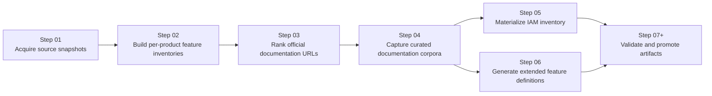
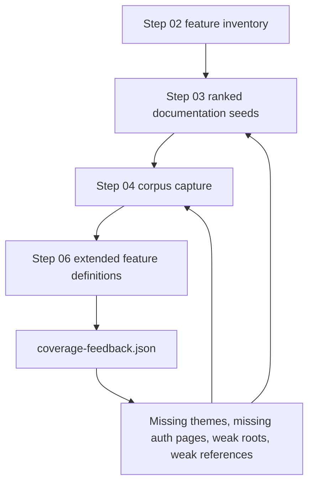
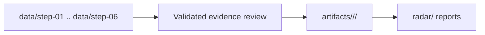

# Pipeline Detail

## Purpose

This document explains the execution model of `gcp-radar` in operational
terms: what each step consumes, what it produces, and how later stages feed
back into earlier ones.

## Pipeline Overview

## Step 01

### Goal

Capture raw official source material into a stable local snapshot that can be
replayed and audited.

### Typical Inputs

- official Google release notes
- official product feeds or source pages

### Typical Outputs

- raw machine-readable snapshots under `data/step-01/`
- normalized source inventories for later steps

### Quality Bar

- deterministic enough to rerun
- explicit source provenance
- no silent dependency on manual browsing state

## Step 02

### Goal

Convert raw source signals into per-product feature inventories.

### Typical Inputs

- Step 01 snapshots

### Typical Outputs

- one markdown file per product under `data/step-02/current/`
- per-product feature counts, summaries, and date signals

### Why It Matters

Step 02 is the first place where product identity becomes concrete. Later
stages depend on it for query generation, coverage hints, and product-family
specific filtering.

## Step 03

### Goal

Find the best official documentation roots and references for each product.

### What It Actually Does

Step 03 is not a full crawler. It is a ranking stage.

It tries to answer:

- What page should represent the product root?
- What page should represent the main product reference?
- What API, IAM, Python, and Java pages are worth keeping?
- Which URLs are official but actually belong to a neighboring product?

### Inputs

- Step 02 feature inventories
- official Google web search results

### Outputs

- `ranking.json`
- `ranking.md`
- global Step 03 index

### Key Heuristics

- prefer crawlable parent pages over deep leaves
- prefer official roots on `docs.cloud.google.com` and `developers.google.com`
- penalize cross-product contamination
- use Step 02 vocabulary to reward feature-aligned pages

### Known Risk

A page can be official and still be a bad seed for corpus building if it is too
narrow, too deep, or not representative of the product.

## Step 04

### Goal

Build a practical documentation corpus for each product from the Step 03
ranking.

### What It Actually Does

Step 04 selects a small number of seeds by family and captures pages through
`know`.

The main concern is not maximum crawl volume. It is useful coverage with low
contamination.

### Inputs

- Step 03 rankings
- Step 02 feature inventory for budget shaping

### Outputs

- `selection.json`
- `state.json`
- per-product `corpus/`
- global Step 04 index

### Operational Signals

- `source_failures`
- `selected_sources_signature`
- `corpus_health`

These fields matter because they make failures reproducible and show whether a
reprocess changed the selected documentation surface.

## Step 05

### Goal

Collect IAM role and permission information directly from Google Cloud tooling.

### Inputs

- Google Cloud CLI access
- project or organization-scoped IAM queries

### Outputs

- machine-readable IAM inventories under `data/step-05/`

### Why It Exists Separately

Some IAM information is better captured from live tooling than from product
documentation alone.

## Step 06

### Goal

Generate extended feature definitions backed by the documentation corpus.

### Inputs

- Step 02 feature inventories
- Step 04 corpora

### Outputs

- `extended-features.json`
- `coverage-feedback.json`
- per-product state in `data/step-06/`

### What Makes Step 06 Valuable

Step 06 is both an extraction stage and a measurement stage.

It tells us:

- which features have support
- which features remain uncovered
- which tokens or concepts are missing from the current corpus

That feedback is what drives the improvement loop for Steps 03 and 04.

## Feedback Loop

## Promotion Path

The later stages turn intermediate research into durable outputs.

## Practical Lessons

- Step 03 quality dominates Step 04 usefulness.
- Step 04 seed choice matters more than raw crawl count.
- Step 06 is the best early warning system for weak documentation selection.
- Product-family-specific rules are required for large Google documentation
  surfaces such as App Engine, Vertex AI, Workspace APIs, and Apigee.

## Reading Path For Contributors

1. Read this document.
2. Read [Repository Map](C:/Users/villa/dev/gcp-radar/docs/repository-map.md).
3. Read the README under the step you are changing.
4. Check active issues under `.specs/issues/` before changing pipeline logic.
