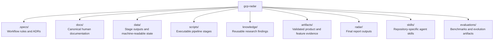

# Repository Map

## Purpose

This document explains how the repository is organized and what each major area
is expected to contain.

## Top-Level Structure

## `.specs/`

Use `.specs/` for project rules and decisions.

- `.specs/specs.md` is the current workflow contract.
- `.specs/adr/` stores architecture decisions.
- `.specs/issues/` stores tracked implementation gaps and evidence-backed
  incidents.

## `docs/`

Use `docs/` for canonical human-facing documentation.

- [README](C:/Users/villa/dev/gcp-radar/docs/README.md) explains the project at
  a high level.
- [Pipeline Detail](C:/Users/villa/dev/gcp-radar/docs/pipeline.md) explains the
  step-by-step execution model.
- [Repository Map](C:/Users/villa/dev/gcp-radar/docs/repository-map.md)
  explains how the repo is organized.

## `data/`

Use `data/` for machine-readable workflow outputs.

The directory is stage-oriented:

- `data/step-01/`
- `data/step-02/`
- `data/step-03/`
- `data/step-04/`
- `data/step-05/`
- `data/step-06/`

Each step may contain:

- `current/` for the latest canonical outputs
- state files
- indexes
- per-product subdirectories

## `scripts/`

Use `scripts/` for executable workflow automation.

Scripts should mirror the stage structure used in `data/`.

Examples:

- `scripts/step-03/score-product-documentation-urls.mjs`
- `scripts/step-04/scrape-product-documentation-with-know.mjs`
- `scripts/step-06/generate-extended-feature-definitions.mjs`

## `knowledge/`

Use `knowledge/` for validated reusable findings that should outlive a single
run.

Examples:

- terminology
- extraction heuristics
- source-host patterns
- family-specific discovery rules

## `artifacts/`

Use `artifacts/` for validated product and feature evidence that is strong
enough to support reporting.

Expected shape:

- one directory per product
- within it, one directory per feature
- within it, validated documentation and evidence

## `radar/`

Use `radar/` for generated end-user outputs or summary reports.

This should be downstream of validated artifacts, not raw discovery outputs.

## `skills/`

Use `skills/` for repository-specific agent skills that help with discovery,
ranking, corpus capture, validation, or reporting.

## `evaluations/`

Use `evaluations/` for benchmark runs, Skill Arena comparisons, and evolution
results that measure whether repository-specific workflows are improving.

## Navigation Advice

- If you are changing logic, start in `scripts/`.
- If you are checking evidence or state, start in `data/`.
- If you are changing project rules, start in `.specs/`.
- If you are explaining the project to a human reader, start in `docs/`.

## Scratch Artifacts

Ad hoc debugging files belong under ignored `tmp/` only. Do not commit root-level
`tmp_*.txt`, `tmp_*.json`, `temp_extract.py`, `out.json`, or `result.json`
artifacts; promote useful examples into documented fixtures before versioning.
